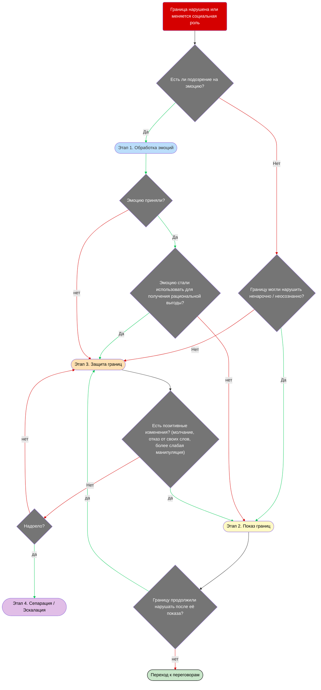

```mermaid    
 flowchart TB

D("Граница нарушена или меняется социальная роль") --> E{"Есть ли подозрение на эмоцию?"}

E -- Да --> A(["Этап 1. Обработка эмоций"])

E -- Нет --> F{"Границу могли нарушить ненарочно / неосознанно?"}

F -- Да --> B(["Этап 2. Показ границ"])

F -- Нет --> C(["Этап 3. Защита границ"])

A --> n1{"Эмоцию приняли?"}

n1 -- Да --> n2{"Эмоцию стали использовать для получения рациональной выгоды?"}

n2 -- Да --> C

n2 -- нет --> B

n1 -- нет --> C

C --> n3{"Есть позитивные изменения? (молчание, отказ от своих слов, более слабая манипуляция)"}

n3 -- да --> B

n3 -- Нет --> n4{"Надоело?"}

n4 -- да --> n5(["Этап 4. Сепарация / Эскалация"])

n4 -- нет --> C

B --> n6{"Границу продолжили нарушать после её показа?"}

n6 -- да --> C

n6 -- нет --> n7(["Переход к переговорам"])

  

style D color:#FFFFFF,fill:#D50000

style E fill:#757575,color:#FFFFFF

style A fill:#BBDEFB

style F color:#FFFFFF,fill:#757575

style B color:#000000,fill:#FFF9C4

style C fill:#FFE0B2,color:#000000

style n1 color:#FFFFFF,fill:#757575

style n2 color:#FFFFFF,fill:#757575

style n3 color:#FFFFFF,fill:#757575

style n4 color:#FFFFFF,fill:#757575

style n5 fill:#E1BEE7,color:#000000

style n6 fill:#757575,color:#FFFFFF

style n7 fill:#C8E6C9,stroke:#000000,color:#000000

linkStyle 1 stroke:#00C853,fill:none

linkStyle 2 stroke:#D50000,fill:none

linkStyle 3 stroke:#00C853,fill:none

linkStyle 4 stroke:#D50000,fill:none

linkStyle 5 stroke:#00C853,fill:none

linkStyle 6 stroke:#00C853,fill:none

linkStyle 7 stroke:#00C853,fill:none

linkStyle 8 stroke:#D50000,fill:none

linkStyle 9 stroke:#D50000,fill:none

linkStyle 11 stroke:#00C853,fill:none

linkStyle 12 stroke:#D50000,fill:none

linkStyle 13 stroke:#00C853,fill:none

linkStyle 14 stroke:#D50000,fill:none

linkStyle 16 stroke:#00C853,fill:none

linkStyle 17 stroke:#D50000,fill:none
```

