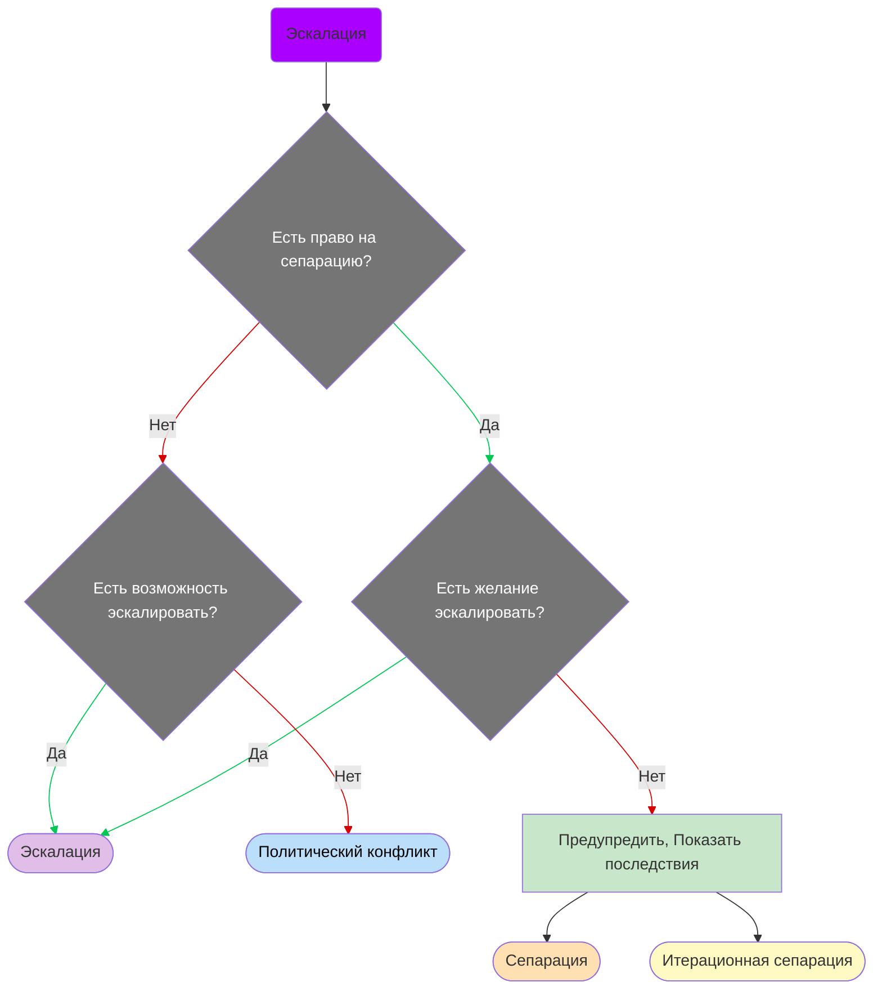

```mermaid  
flowchart TB  
n5("Эскалация") --> n8{"Есть право на сепарацию?"}  
n8 -- Да --> n9{"Есть желание эскалировать?"}  
n9 -- Да --> n10(["Эскалация"])  
n8 -- Нет --> n11{"Есть возможность эскалировать?"}  
n11 -- Нет --> n12(["Политический конфликт"])  
n13["Предупредить, Показать последствия"] --> n14(["Сепарация"]) & n15(["Итерационная сепарация"])  
n11 -- Да --> n10  
n9 -- Нет --> n13  
  
  
style n5 fill:#AA00FF  
style n8 fill:#757575,color:#FFFFFF  
style n9 fill:#757575,color:#FFFFFF  
style n10 fill:#E1BEE7  
style n11 color:#FFFFFF,fill:#757575  
style n12 color:#000000,fill:#BBDEFB  
style n13 fill:#C8E6C9  
style n14 fill:#FFE0B2  
style n15 fill:#FFF9C4  
linkStyle 1 stroke:#00C853,fill:none  
linkStyle 2 stroke:#00C853,fill:none  
linkStyle 3 stroke:#D50000,fill:none  
linkStyle 4 stroke:#D50000,fill:none  
linkStyle 7 stroke:#00C853,fill:none  
linkStyle 8 stroke:#D50000  
```